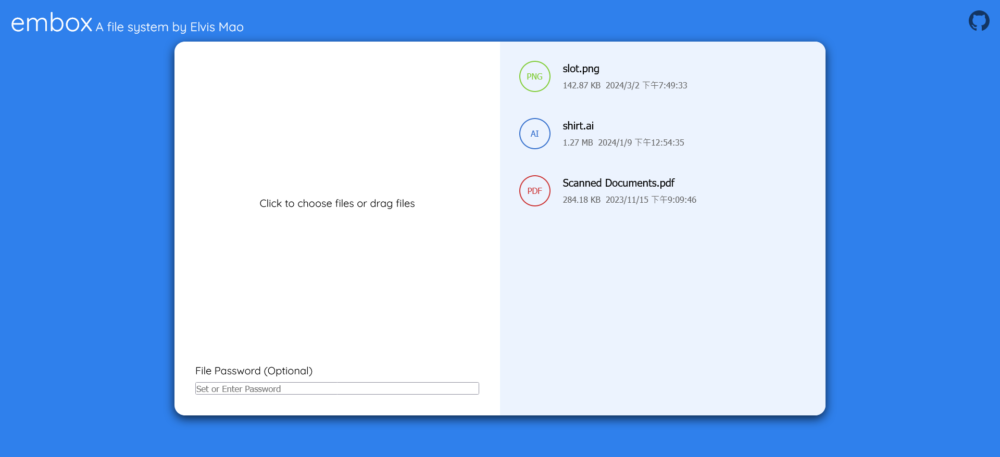
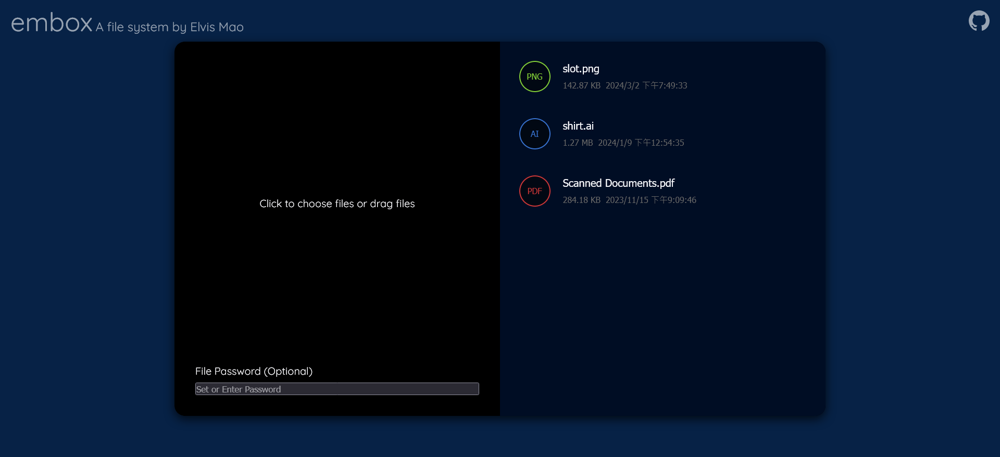
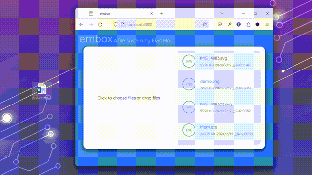

<!-- @format -->

# embox

A simple node.js website to upload and download file.





## Features

- Upload file
- Download file
- Colorful UI
- Support dark mode
- Responsive design
- SSL support
- No database required
- Drag and drop file upload
- API support



## Requirements

- Node.js

## Installation

```bash
git clone https://github.com/Edit-Mr/embox.git
cd embox
npm install
node index.js
```

> server.js is the version with SSL support, you can use it if you have a SSL certificate.

## API

### Upload

```bash
curl -X POST -F "file=@/path/to/file" http://localhost:3000/api/upload
```

### Download

```bash
curl -X GET http://localhost:3000/box/filename
```

### File list

```bash
curl -X GET http://localhost:3000/list
```

## Credits

Made by [Elvis Mao](https://elvismao.com). Quicksand font by [Andrew Paglinawan](https://www.fontsquirrel.com/fonts/quicksand).
